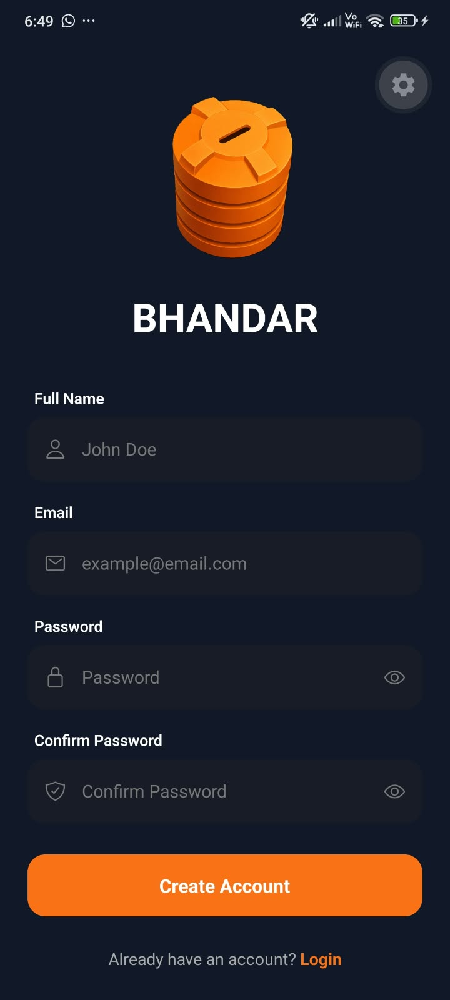
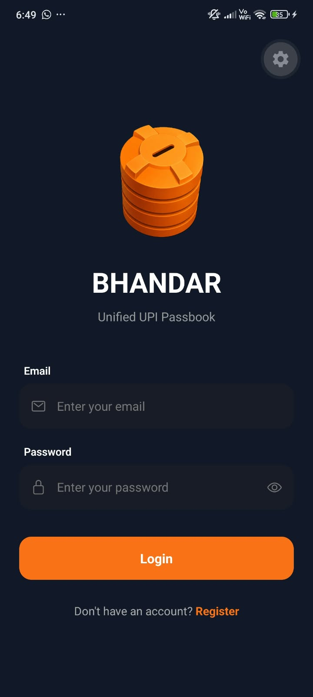
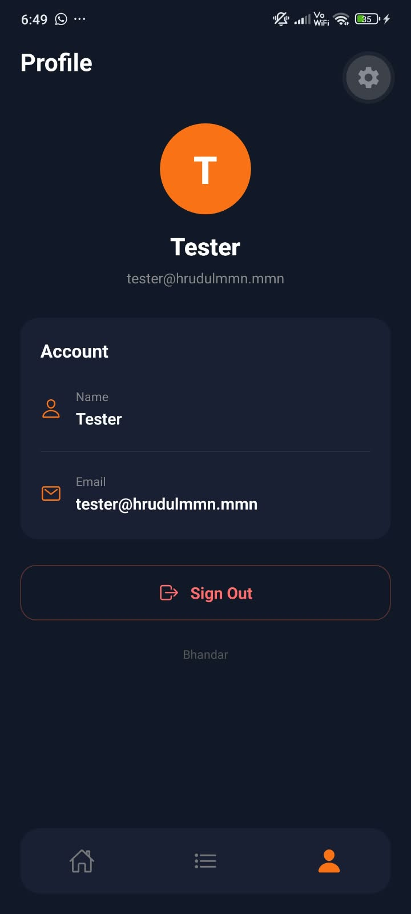
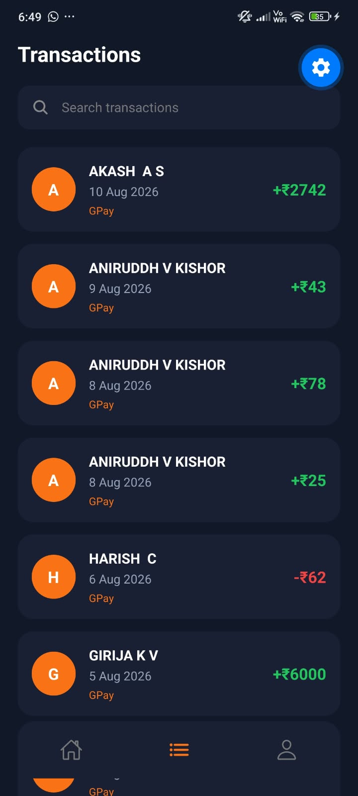
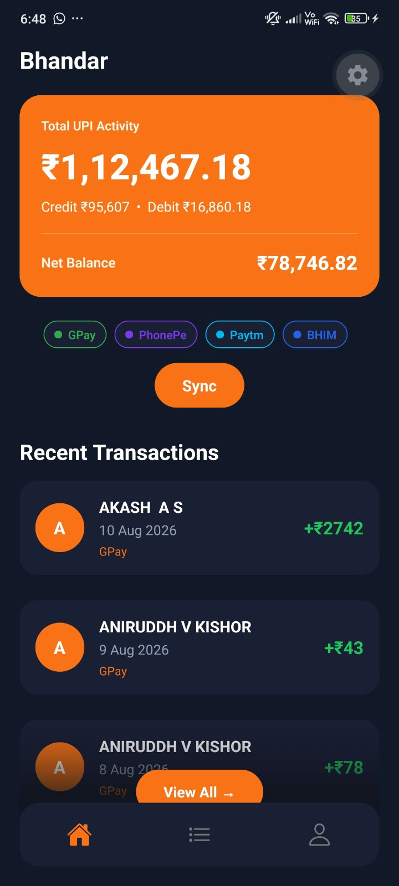

# Bhandar

> **Your Unified UPI Passbook**

Bhandar is an Android mobile app that collects UPI transaction information from supported bank SMS messages and presents it in one unified passbook. It combines bank-specific SMS parsing, authenticated backend storage, transaction history, dashboard data, and user management.

## Screenshots
<table>
  <tr>
    <td></td>
    <td></td>
    <td></td>
  </tr>
  <tr>
    <td></td>
    <td></td>
  </tr>
</table>

## Features

- User registration, login and logout
- JWT authentication
- Secure token storage with Expo SecureStore
- Current-user/session verification
- Android SMS reading and permission handling
- Bank-specific transaction parsing
- SBI and Canara Bank support
- Irrelevant SMS filtering
- User-specific transaction synchronization
- Duplicate prevention using transaction fingerprints
- Recent and complete transaction history
- Transaction search
- Individual transaction details
- Dashboard with real transaction totals
- Profile page
- Analytics planned as the next major feature

## Tech Stack

**Frontend:** React Native, Expo, TypeScript, Expo Router, Axios, Expo SecureStore, Expo Image, Expo Linear Gradient.

**Backend:** Python, FastAPI, SQLAlchemy, Pydantic, JWT authentication, PostgreSQL-compatible database / ShaktiDB.

## How It Works

```text
Android SMS
    ↓
SMS Reader
    ↓
Bank-specific Parser
    ↓
Parsed Transaction
    ↓
Authenticated FastAPI API
    ↓
Database
    ↓
Bhandar Dashboard / Transactions
```

Only supported bank parsers are used. If an SMS does not match a supported parser, it is ignored rather than being processed by a generic fallback parser.

Currently supported banks:

- SBI
- Canara Bank

## Authentication

Bhandar uses JWT authentication.

```text
Register / Login
      ↓
FastAPI
      ↓
JWT Access Token
      ↓
Expo SecureStore
      ↓
Axios Authorization Header
      ↓
Protected API
```

The app verifies the current user when it starts. Backend transaction endpoints are protected and transactions belong to the authenticated user.

## Synchronization

The frontend stores a user-specific SMS synchronization checkpoint in SecureStore:

```text
last_sync_<userId>
```

During synchronization:

1. SMS messages are read from the device.
2. Older messages are skipped.
3. Supported bank messages are parsed.
4. Valid transactions are sent to FastAPI.
5. The checkpoint is updated after successful synchronization.
6. The backend fingerprint prevents duplicate transactions.

SecureStore is only the device-side sync checkpoint. Actual transaction data and ownership are stored in the backend database.

## Backend API

### Authentication

```http
POST /auth/register
POST /auth/login
GET  /auth/me
```

### Transactions

```http
POST   /transactions/
GET    /transactions/
GET    /transactions/recent
GET    /transactions/dashboard
GET    /transactions/{trans_id}
DELETE /transactions/{trans_id}
```

Transaction endpoints require the authenticated user's JWT.

## Backend Setup

From the backend directory:

### 1. Create/activate the Python environment

Windows:

```powershell
python -m venv .venv
.\.venv\Scripts\Activate.ps1
```

Linux / WSL:

```bash
python3 -m venv .venv
source .venv/bin/activate
```

### 2. Install dependencies

```bash
pip install -r requirements.txt
```

### 3. Configure the database

Make sure the configured PostgreSQL-compatible database / ShaktiDB service is running and that the backend database configuration points to it.

Use the project's configured database URL/environment variables rather than hard-coding credentials.

### 4. Start FastAPI

For development on the same PC:

```bash
python -m uvicorn app.main:app --reload
```

To allow a physical phone on the same network to reach the backend:

```bash
python -m uvicorn app.main:app --host 0.0.0.0 --port 8000
```

Test on the PC:

```text
http://127.0.0.1:8000/docs
```

For a physical phone:

```text
http://YOUR_PC_IP:8000/docs
```

The phone and PC must be able to communicate over the same network. Windows Firewall may also need to allow inbound TCP traffic on port `8000`.

## Frontend Setup

From the frontend directory:

### 1. Install dependencies

```bash
npm install
```

### 2. Configure the API

For a physical Android phone, set the Axios base URL to the PC's current LAN IPv4 address:

```ts
const api = axios.create({
  baseURL: "http://YOUR_PC_IP:8000",
});
```

Do not use `localhost` for a physical phone. `localhost` on the phone refers to the phone itself.

For an Android emulator, use the emulator's appropriate host address.

### 3. Start Expo

```bash
npx expo start
```

Clear Metro's cache if needed:

```bash
npx expo start -c
```

## Native Android / Prebuild

Bhandar reads Android SMS messages, so native Android functionality is required for SMS-related features.

After installing or changing native dependencies/configuration, generate the native project:

```bash
npx expo prebuild
```

Then build/run Android:

```bash
npx expo run:android
```

If native configuration becomes inconsistent and you intentionally want to regenerate native projects:

```bash
npx expo prebuild --clean
```

`--clean` deletes and regenerates native project files, so use it deliberately.

For normal TypeScript/UI changes, **do not run prebuild**. Use:

```bash
npx expo start
```

or:

```bash
npx expo start -c
```

## Android Permissions

SMS synchronization requires the appropriate Android SMS permissions. The app requests permission when synchronization is started.

If permissions or native configuration change, rebuild the Android app after updating the native configuration.

## Development Workflow

```text
1. Start database
       ↓
2. Start FastAPI
       ↓
3. Verify /docs on PC
       ↓
4. Verify /docs from phone when using a physical device
       ↓
5. Start Expo
       ↓
6. Open Bhandar
       ↓
7. Login
       ↓
8. Grant SMS permission
       ↓
9. Sync transactions
       ↓
10. Verify dashboard / transaction history
```

## Dashboard

The dashboard uses backend data rather than hard-coded mock values.

The dashboard endpoint provides:

```text
total_credit
total_debit
transaction_count
recent_trans
```

The current dashboard represents recorded transaction activity and should not be interpreted as the user's actual bank account balance.

## Security

- Passwords are handled by the backend authentication system.
- JWT access tokens are stored using Expo SecureStore.
- Protected API requests use Bearer authentication.
- Transactions are associated with authenticated users.
- Backend ownership checks prevent users from accessing another user's transactions.
- SMS messages are parsed on the device before transaction data is sent to the backend.

Do not commit database passwords, JWT secrets, API keys, or other credentials to Git.

## Current MVP

### Completed

- [x] Authentication
- [x] User/session handling
- [x] SMS permissions
- [x] SMS reading
- [x] SBI parser
- [x] Canara parser
- [x] Bank-specific parsing
- [x] Irrelevant SMS filtering
- [x] Transaction synchronization
- [x] User-specific sync checkpoint
- [x] Backend transaction storage
- [x] Transaction deduplication
- [x] Dashboard
- [x] Transaction list/search
- [x] Transaction details
- [x] Profile and sign out

### Next

- [ ] Spending analytics
- [ ] Category-wise spending
- [ ] Monthly credit/debit trends
- [ ] Top merchants
- [ ] Payment-app analytics
- [ ] Spending comparisons
- [ ] Financial insights
- [ ] Additional bank parsers
- [ ] Better merchant normalization
- [ ] Automatic category detection
- [ ] Export/report features

## Development Status

**Bhandar MVP — Complete**

The core pipeline is functional:

```text
SMS
 ↓
Bank Detection
 ↓
Bank-specific Parsing
 ↓
Transaction Validation
 ↓
JWT-authenticated FastAPI
 ↓
Database
 ↓
Dashboard
 ↓
Unified UPI Passbook
```

The next development phase is **Analytics & Financial Insights**.
